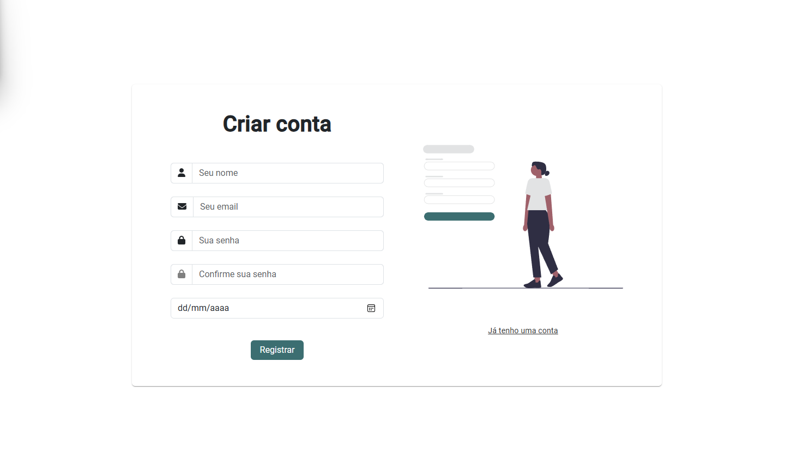
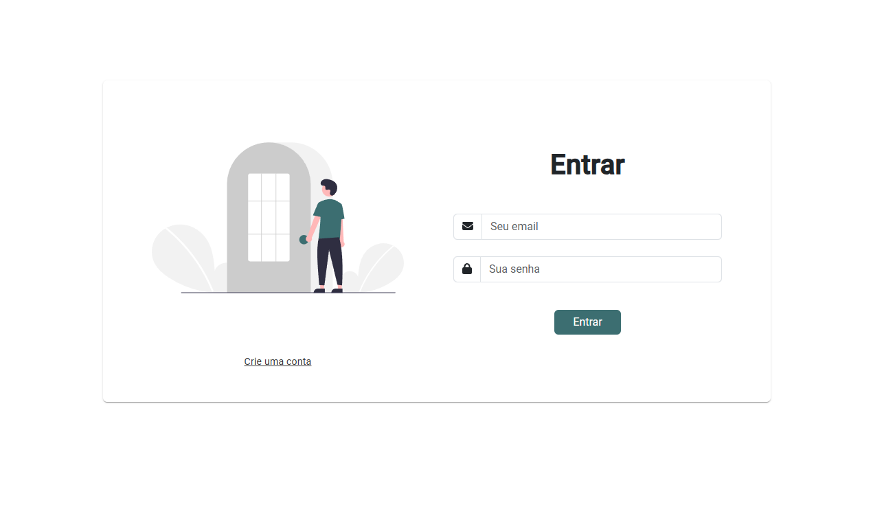
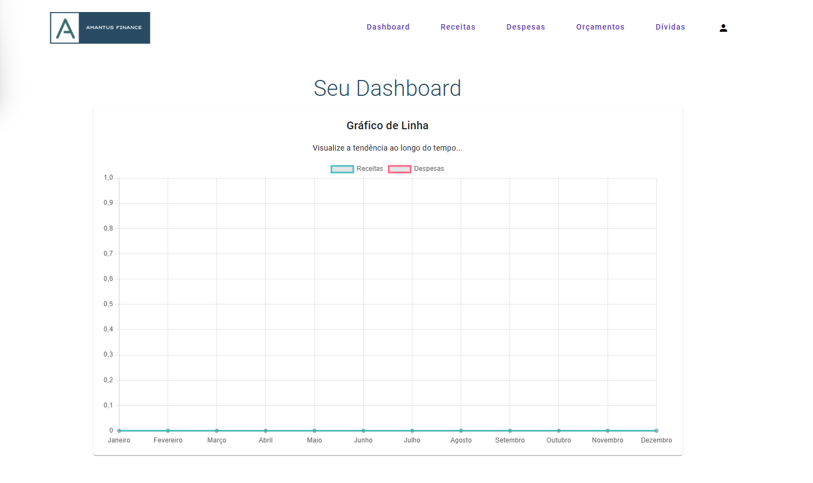
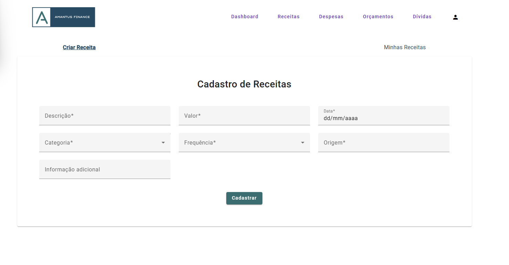
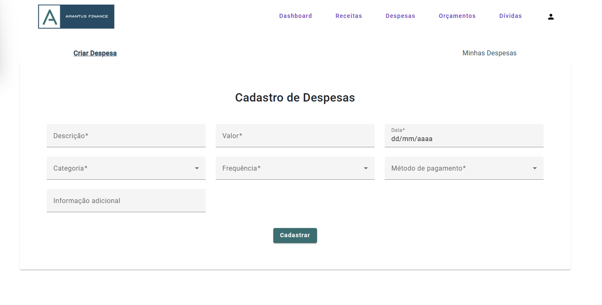
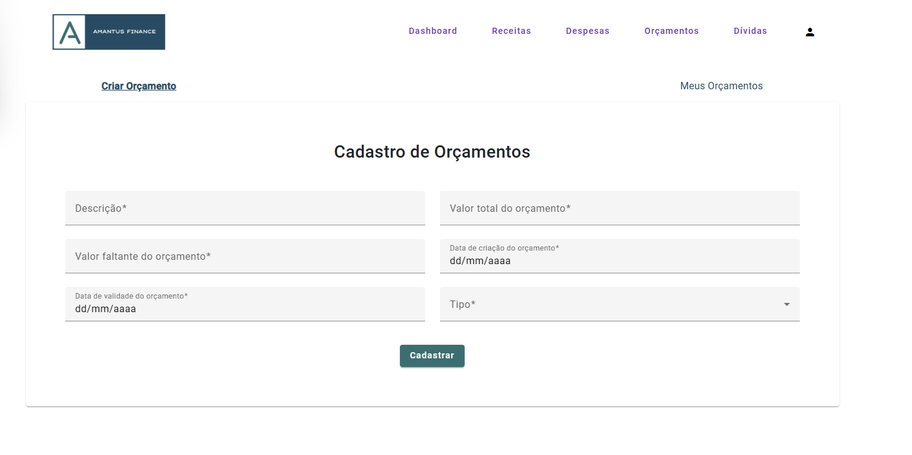
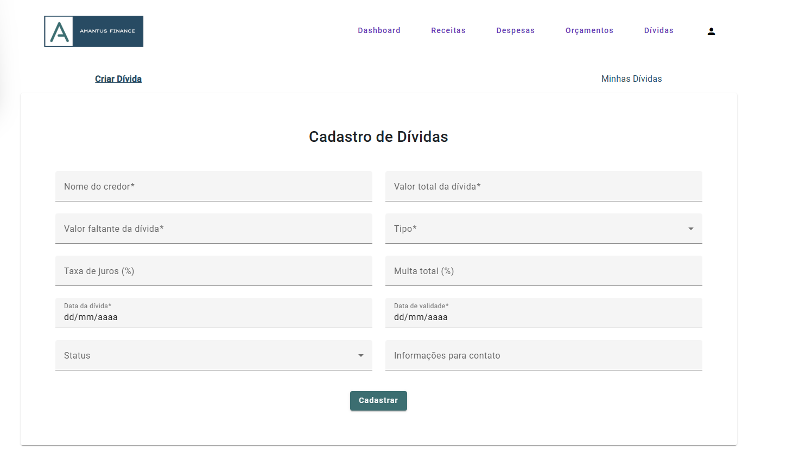
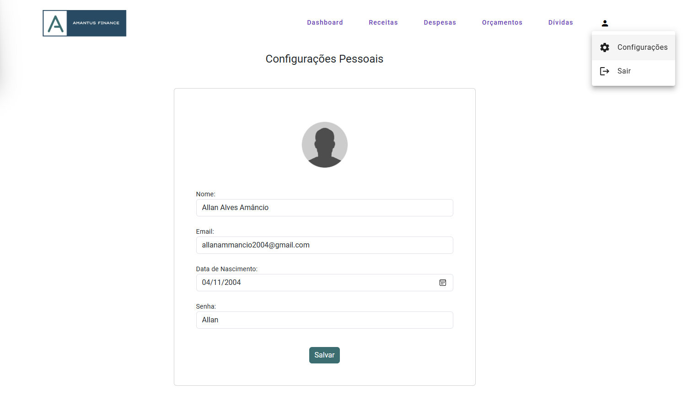
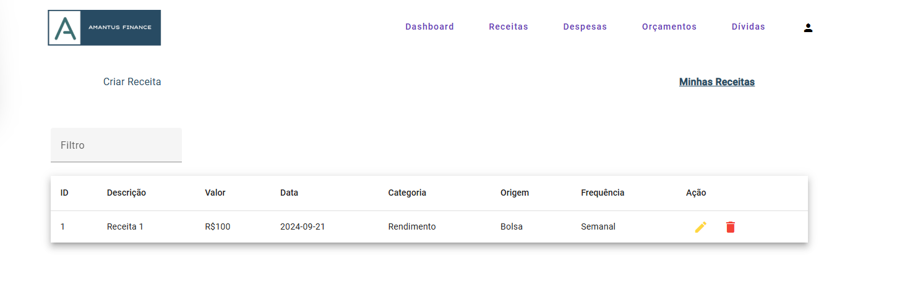

# Amantus Finance

**Amantus Finance** é uma aplicação abrangente de gestão financeira pessoal, projetada para capacitar indivíduos a assumir o controle de suas finanças e promover uma gestão eficiente e inteligente de renda, despesas, investimentos, economias e dívidas. 

Seja você alguém que está buscando melhorar seus hábitos financeiros, criar orçamentos mensais, economizar para uma grande compra, acompanhar detalhadamente suas despesas diárias ou planejar sua aposentadoria, **Amantus Finance** oferece as ferramentas certas para te ajudar.

## Funcionalidades

- **Cadastro e Autenticação de Usuários**: Registre-se e acesse sua conta de maneira segura, garantindo que suas informações financeiras estejam protegidas.
- **Gerenciamento de Receitas e Despesas**: Adicione, edite e acompanhe suas receitas e despesas com facilidade, categorizando-as conforme necessário (salários, pagamentos, lazer, etc.).
- **Relatórios Financeiros**: Gere relatórios detalhados que ajudam a visualizar seu desempenho financeiro, com gráficos e estatísticas personalizáveis.
- **Orçamentos Mensais**: Estabeleça orçamentos mensais para categorias específicas e veja como seu gasto real se compara ao planejado.
- **Planejamento de Investimentos e Dívidas**: Planeje e acompanhe seus investimentos e dívidas, mantendo-se atualizado sobre o saldo total e rendimentos.

## Tecnologias Utilizadas

### Backend
- **Java** com **Spring Boot**: Framework para criar o servidor back-end que lida com a lógica de negócios.
- **Hibernate**: Implementação JPA para mapeamento objeto-relacional.
- **PostgreSQL**: Banco de dados relacional para armazenar as informações dos usuários, receitas e despesas.
- **Jakarta Persistence API (JPA)**: Para mapeamento objeto-relacional.

### Frontend
- **Angular**: Framework para desenvolvimento da interface do usuário, proporcionando uma experiência de uso intuitiva e fluida.
- **TypeScript**: Linguagem principal no desenvolvimento do front-end.
- **HTML5/CSS3**: Para criação e estilização das páginas.
- **Bootstrap**: Framework CSS para design responsivo e moderno.

### Outros
- **Maven**: Gerenciamento de dependências e build da aplicação.

## Instalação

Siga estas etapas para executar o projeto localmente:

### Pré-requisitos

- **Java 17** ou superior
- **Node.js** (versão 16 ou superior)
- **Angular CLI** (última versão)
- **PostgreSQL**

### Backend (Spring Boot)

- Clique [aqui](https://github.com/AllanSmithll/amantus-finance-backend) para acessar o repositório Backend.

## Issues

Se você encontrar algum problema ou tiver uma sugestão de melhoria para o Amantus Finance, sinta-se à vontade para abrir uma **issue** no GitHub. Abaixo estão alguns tipos de issues que você pode abrir:

1. **Bugs**: se algo não está funcionando como esperado, por favor, crie uma issue detalhando o problema. Certifique-se de incluir:
  - Descrição clara do bug
  - Passos para reproduzir o problema
  - Qual foi o resultado esperado
  - Informações sobre o ambiente (versão do navegador, sistema operacional, etc.)

2. **Novos recursos**: se você tem uma ideia para uma nova funcionalidade que pode melhorar o Amantus Finance, crie uma issue descrevendo como você acha que o recurso deve funcionar, o problema que ele resolveria, e como ele beneficiaria os usuários.

3. **Documentação**: se você encontrar erros na documentação ou áreas que precisam de mais esclarecimentos, crie uma issue relacionada à documentação. Isso nos ajudará a melhorar a clareza e precisão das informações.

### Como abrir uma issue

1. Navegue até a aba de **Issues** no repositório do GitHub.
2. Clique no botão **New Issue**.
3. Escolha o template apropriado, se aplicável (por exemplo, bug, feature request, etc.).
4. Preencha os detalhes relevantes e clique em **Submit new issue**.

A comunidade e os mantenedores irão revisar sua issue e responder assim que possível.

## Licença

Este projeto está licenciado sob a [Licença MIT](LICENSE). Veja o arquivo [LICENSE](LICENSE) para mais detalhes.
